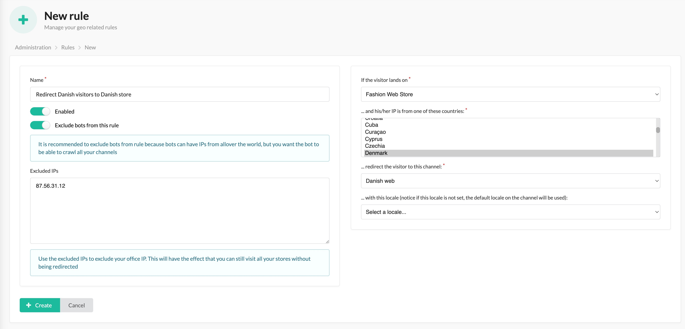

# Sylius Geo Plugin

[![Latest Version][ico-version]][link-packagist]
[![Software License][ico-license]](LICENSE)
[![Build Status][ico-github-actions]][link-github-actions]
[![Code Coverage][ico-code-coverage]][link-code-coverage]

This plugin allows an administrator to create rules based on the visitors country and redirect the visitor to a more
appropriate channel if applicable. An example could be that you have an international store called example.com and a few
locale stores, e.g. example.de, example.co.uk etc. If a user is from Germany, but lands on the international version
this plugin gives you the tools to redirect the visitor to the locale store. It will even try to redirect the visitor
to the correct product/taxon/whatever.

## Installation

### Step 1: Download the plugin

```bash
composer require setono/sylius-geo-plugin
```

### Step 2: Enable the plugin

Then, enable the plugin by adding it to the list of registered plugins/bundles
in `config/bundles.php` file of your project before (!) `SyliusGridBundle`:

```php
<?php
$bundles = [
    Setono\SyliusGeoPlugin\SetonoSyliusGeoPlugin::class => ['all' => true],
    Sylius\Bundle\GridBundle\SyliusGridBundle::class => ['all' => true],
];
```

### Step 3: Configure plugin

```yaml
# config/packages/setono_sylius_geo.yaml
imports:
    - { resource: "@SetonoSyliusGeoPlugin/Resources/config/app/config.yaml" }
```

### Step 4: Import routing

```yaml
# config/routes/setono_sylius_geo.yaml
setono_sylius_geo:
    resource: "@SetonoSyliusGeoPlugin/Resources/config/routes.yaml"
```

### Step 5: Update your database schema

```bash
php bin/console doctrine:migrations:diff
php bin/console doctrine:migrations:migrate
```

### Step 6: Use an existing country code provider or create a new one

The plugin uses [country code providers](src/Provider) to provide the country code. The plugin comes with a single
country code provider which is based on request headers. If you want to create your own provider, all you have to do
is implement the [CountryCodeProviderInterface](src/Provider/CountryCodeProviderInterface.php). The service will be
automatically tagged as `setono_sylius_geo.country_code_provider`.

**NOTE:** If you are using Cloudflare all you have to do is within your dashboard go to
`Rules > Transform Rules > Managed Transforms` and enable the `Add visitor location headers`.

## Usage

Go to https://your-store.com/admin/geo/rules/new to create a new rule. Here is an example:



As you can see our goal is to redirect Danish visitors to our locale Danish store. We have excluded bots and our
office IP so that bots can freely crawl our international store, and we are able to browse the international store
without being redirected, although we are based in Denmark.

[ico-version]: https://poser.pugx.org/setono/sylius-geo-plugin/v/stable
[ico-license]: https://poser.pugx.org/setono/sylius-geo-plugin/license
[ico-github-actions]: https://github.com/Setono/SyliusGeoPlugin/workflows/build/badge.svg
[ico-code-coverage]: https://codecov.io/gh/Setono/SyliusGeoPlugin/branch/master/graph/badge.svg

[link-packagist]: https://packagist.org/packages/setono/sylius-geo-plugin
[link-github-actions]: https://github.com/Setono/SyliusGeoPlugin/actions
[link-code-coverage]: https://codecov.io/gh/Setono/SyliusGeoPlugin
